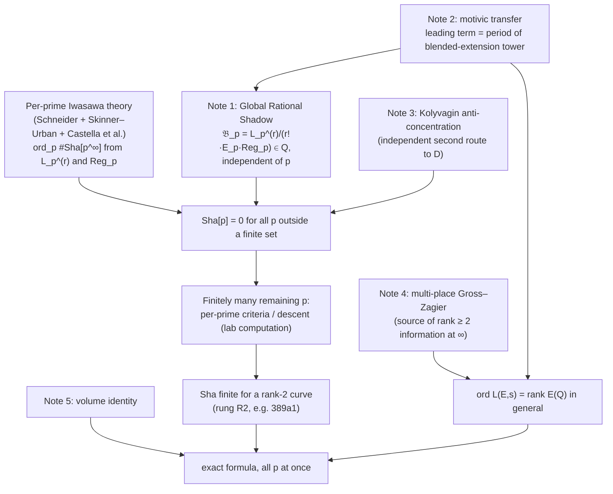

# New directions toward BSD beyond rank 1

*Research notes, 2026-09-13. Thinking only: no code, no claimed theorems
beyond the elementary lemmas proved inline.*

> **Read this first.** None of this proves the Birch and Swinnerton-Dyer
> conjecture, or any open case of it. These notes propose mathematical
> strategies. As far as a limited literature check could tell, they have not
> been set out in this form before. Each one comes with its known
> antecedents, what exactly is new, the step most likely to fail, and a
> numerical test this lab can run to kill it cheaply. "New" is a hypothesis
> about the literature, checked against the sources cited in each note (see
> §5). It is not a guarantee. Ideas we worked out and then **killed** are kept
> in [`GRAVEYARD.md`](GRAVEYARD.md), because a clean kill argument is also a
> result.

## 1. The three obstacles we were asked to address

1. **A control theorem in arbitrary rank.** Euler-system and Iwasawa methods
   control rank ≤ 1, and some rank 2 cases one prime at a time, but nothing
   works in general rank.
2. **An exact matching, not just parity.** The full leading coefficient
   `L^(r)(E,1)/r!` must match `Ω · Reg · ∏c_p · #Sha / |tors|²`. That is far
   finer than rank equality.
3. **Genuinely new machinery**, in the way Wiles's modularity lifting
   theorems were new for Fermat.

## 2. Where the frontier actually is (September 2026)

[`BARRIER.md`](../BARRIER.md) was written as if rank 2 were untouched. That is
no longer accurate, and the correction changes the strategy:

- **Rank-2 Selmer theory now exists one prime at a time.** Castella–Hsieh
  (Forum Math. Sigma 2022) showed that non-vanishing of a generalised Kato class
  `κ_p` gives `dim Sel(Q, V_pE) = 2`. Castella (arXiv:2204.09608) did the same
  for CM curves of rank 2. A September 2026 preprint (arXiv:2609.08431) proved,
  for rank-2 CM curves and outside an explicit set of primes, that the
  normalised `L_p''` is a `p`-adic unit **iff** `Reg_p` is a unit **and**
  `Sha[p^∞] = 0`. It then checked every good ordinary `p < 30000` on five
  curves.
- **Higher-rank Kolyvagin-system technology exists.** This includes
  Kolyvagin's structure theorem (1991), W. Zhang's proof of Kolyvagin's
  conjecture (2014), Sweeting's patched/ultra-Kolyvagin systems
  (arXiv:2012.11771), Angurel's exterior-power ultra-Kolyvagin systems
  (arXiv:2605.26917), and C.-H. Kim's Kolyvagin-system refinement of
  Gross–Zagier with no low-rank assumption (arXiv:2203.12161).
- **A higher-derivative Gross–Zagier formula exists only over function
  fields**, by Yun–Zhang (Annals 2017, 2019) and extensions to deeper level
  (arXiv:2607.07531). No number-field analogue with derivative order `> 1`
  is known.

**Our reading of this landscape:** the rank-2 wall has changed shape.
Per-prime control is arriving. What nobody has is:

- **(W1) Uniformity in p.** Finiteness of `Sha` needs `Sha[p] = 0` for all
  but finitely many `p` simultaneously. Every known rank-2 detector (Kato
  classes, Kolyvagin classes, `L_p''`, Stark–Heegner points) is attached to
  one prime at a time.
- **(W2) The archimedean place.** No known object sees the *complex*
  `L''(E,1)` geometrically. Per-prime results see `L_p`, and the equality
  `ord L_p = ord L` is itself open for `r ≥ 2`.

The notes below attack W1 and W2 directly.

## 3. The notes

| # | Note | Main idea, one line | Obstacles hit |
|---|---|---|---|
| 1 | [`01_global_rational_shadow.md`](01_global_rational_shadow.md) | Uniformity needs a p-independent rational number. We state the **Global Rational Shadow** principle, prove an ultraproduct reformulation of `Sha[p]=0` for almost all `p`, and give a Borel–Cantelli no-go against "one test per prime" arguments. | 1, 2 |
| 2 | [`02_motivic_transfer.md`](02_motivic_transfer.md) | The leading Taylor coefficient as a period of an **r-step blended extension tower**. If it is motivic, complex and `p`-adic leading terms share one rational shadow, which gives `ord L_p = ord L` and uniformity at once. | 2, 3 |
| 3 | [`03_kolyvagin_anticoncentration.md`](03_kolyvagin_anticoncentration.md) | Reduce `Sha[p]=0` to non-vanishing mod `p` of an explicit discrete-log-weighted toric period. Explains why analytic equidistribution cannot see it, why at least two independent auxiliary choices per prime are needed, and proposes a Frobenius large sieve. Extends to rank `r` by parity-chosen twists. | 1, 3 |
| 4 | [`04_multiplace_gross_zagier.md`](04_multiplace_gross_zagier.md) | Why number-field Gross–Zagier stops at the first derivative: the product formula is linear in `log`. The r-th s-derivative of the Gross–Zagier kernel splits into sums over r-tuples of places. We conjecture a **multi-place intersection pairing** and give a descent test. | 3, 2 |
| 5 | [`05_bloch_volume.md`](05_bloch_volume.md) | The exact formula as a harmonic-analysis volume identity on Bloch's semi-abelian group, in Manin–Peyre/Batyrev–Tschinkel style. Poitou–Tate supplies `Sha`, the Mordell–Weil lattice paired with its dual supplies `Reg`, and the partial Euler products supply `L`. The most speculative note. | 2 |
| — | [`GRAVEYARD.md`](GRAVEYARD.md) | Eight ideas we developed and then killed, each with its kill argument. | — |
| — | [`EXPERIMENTS.md`](EXPERIMENTS.md) | Five falsification experiments for this lab, with priorities, inputs and kill criteria. | — |

## 4. How the pieces would fit together

The shortest route to a **historic first** is `A + C + F ⇒ G` for one curve
such as `389a1`. It needs no new point constructions, because the generators
of `389a1` are known. The only missing ingredient is uniformity in `p`, which
is exactly Note 1's target.

## 5. Literature check performed

Searches on 2026-09-13 covered: generalised Kato classes in rank 2; the
Kolyvagin structure theorem and explicit Kolyvagin classes on `389a1`
(Jetchev–Lauter–Stein 2009); higher Gross–Zagier formulas over number fields;
Bloch's Tamagawa-number form of BSD; `p`-adic heights of level-raised Heegner
points; patched and ultra-Kolyvagin systems; uniform-in-`p` non-vanishing of
Heegner points; and recent rank-2 `Sha` results. Each note names its nearest
antecedents. A specialist should repeat this check before relying on any
novelty claim.
